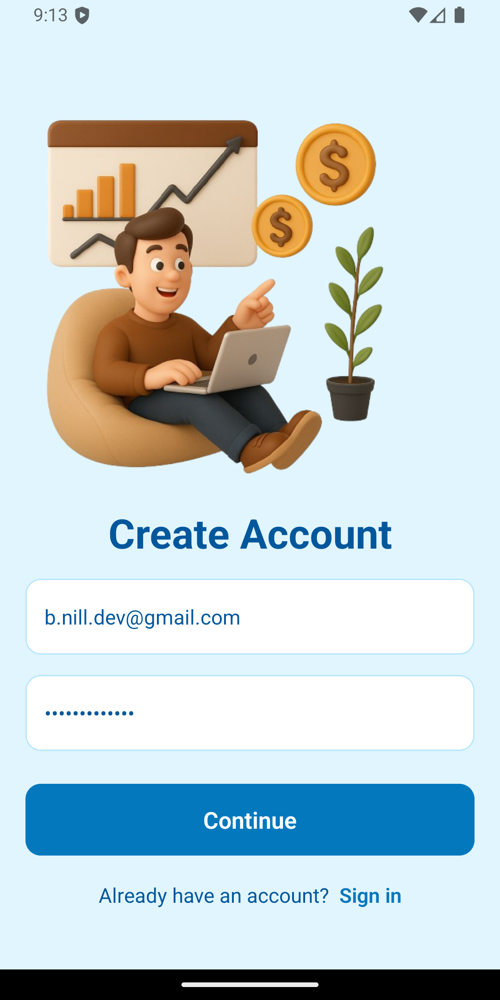
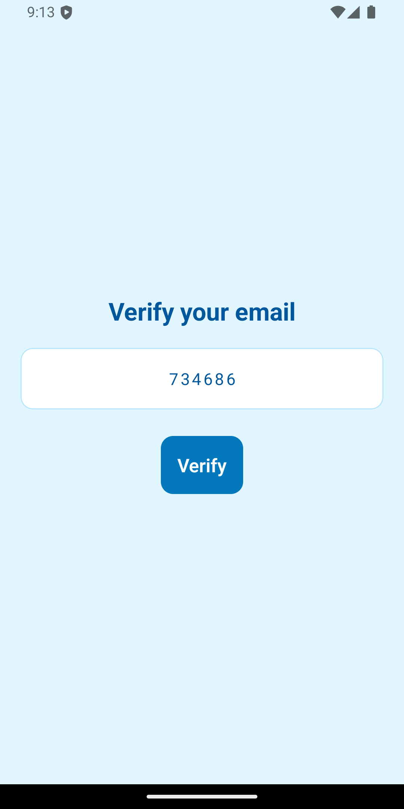
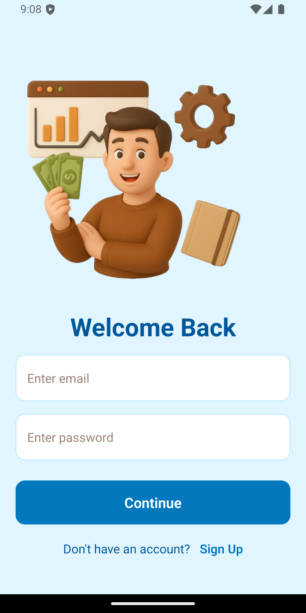
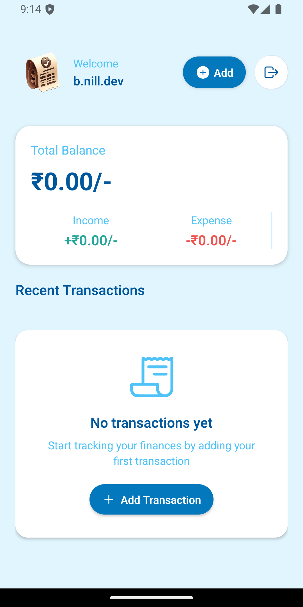
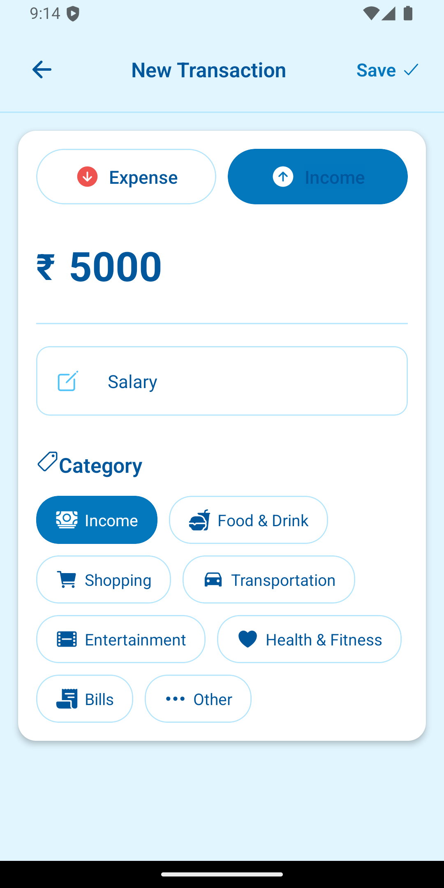
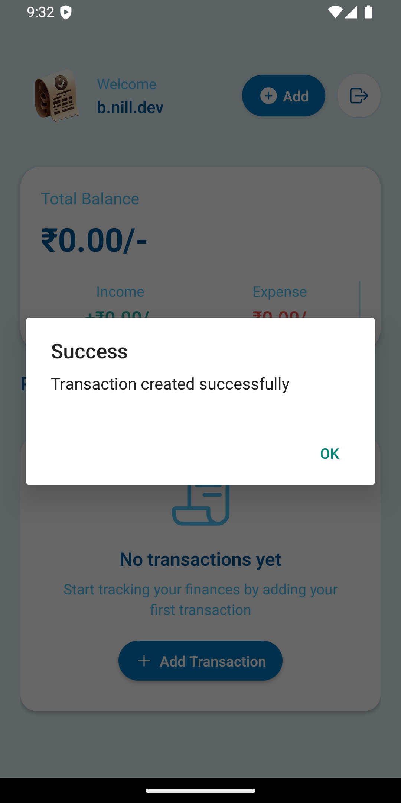
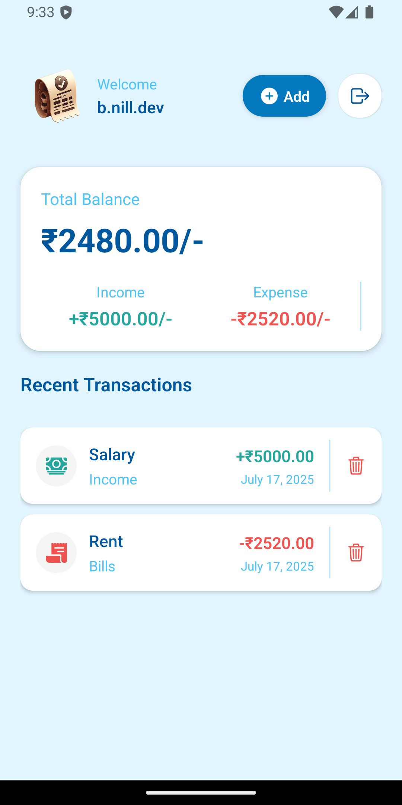
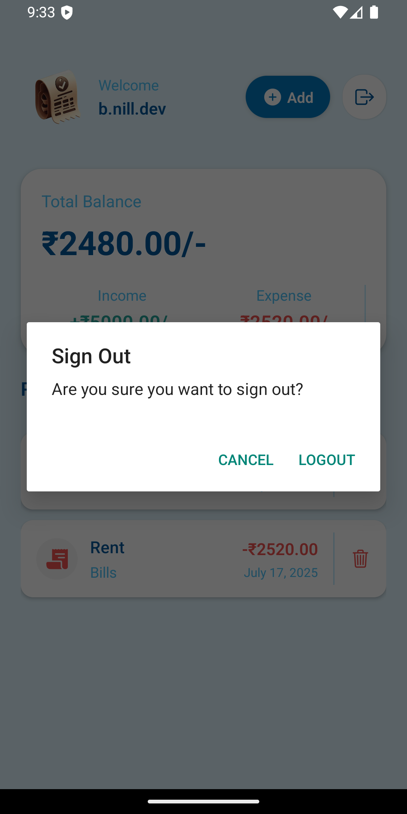

# 📱 FinSights Expense Tracker App

A full-stack expense tracking application built with:

- **Backend**: Node.js, Express, MongoDB, Upstash (Redis), Cron jobs  
- **Mobile Frontend**: React Native (Expo), Expo Router, Clerk for authentication  

---

## 📚 Table of Contents

1. [Demo & Screenshots](#-screenshots)  
2. [Features](#features)  
3. [Tech Stack](#tech-stack)  
4. [Prerequisites](#prerequisites)  
5. [Installation & Setup](#installation--setup)  
   - [Backend](#backend)  
   - [Mobile App](#mobile-app)  
6. [Environment Variables](#environment-variables)  
7. [Usage](#usage)  
   - [Backend API Endpoints](#backend-api-endpoints)  
   - [Mobile App Flow](#mobile-app-flow)  
8. [Project Structure](#project-structure)  
9. [Cron Jobs & Rate Limiting](#cron-jobs--rate-limiting)  
10. [Testing](#testing)  
11. [Roadmap & Future Improvements](#roadmap--future-improvements)  
12. [Contributing](#contributing)  
13. [License](#license)  
14. [Contact Me](#-contact-me)

---

## 🖼️ Screenshots

  
  
  
  
  
  
  


---

## ✨ Features

- 🔐 **User Authentication** via Clerk  
- 📝 **CRUD** operations on income/expenses  
- 📊 **Balance Overview** with total income vs. expenses  
- 🚫 **Rate Limiting** on API to prevent abuse  
- 📱 **Mobile UI** built with React Native & Expo  
- 🔒 **Secure**: JWT tokens, environment-based config

---

## 🧰 Tech Stack

| Layer        | Technologies                              |
|--------------|--------------------------------------------|
| Backend      | Node.js, Express                           |
| Database     | MongoDB                                    |
| Cache/Jobs   | Upstash Redis, cron                        |
| Auth         | Clerk.js (Expo SDK)                        |
| Mobile       | React Native, Expo, Expo Router            |
| Styling      | Tailwind-inspired CSS-in-JS (auth, etc.)   |

---

## ✅ Prerequisites

- Node.js ≥ 18.x  
- npm ≥ 9.x  
- MongoDB (Atlas cluster or local)  
- Upstash Redis account  
- Expo CLI (`npm install -g expo-cli`)  
- Clerk account

---

## 🚀 Installation & Setup

### 🔧 Backend

```bash
cd FinSights-main/Backend
npm install
````

1. Create a `.env` file (see [Environment Variables](#environment-variables)).
2. Start the server:

```bash
npm run start
```

By default, it runs at: `http://localhost:3000`

---

### 📱 Mobile App

```bash
cd FinSights-main/Mobile
npm install
```

1. Ensure your `app.json` is properly configured.
2. Run the app:

```bash
expo start
```

3. Scan QR with Expo Go (Android/iOS)

---

## 🔐 Environment Variables

**Backend `.env`**

```env
MONGO_URI=your_mongodb_connection_string
UPSTASH_REDIS_URL=your_upstash_redis_rest_url
UPSTASH_REDIS_TOKEN=your_upstash_redis_token
JWT_SECRET=your_jwt_secret
PORT=5000
```

**Mobile `.env`**

```env
EXPO_PUBLIC_CLERK_PUBLISHABLE_KEY=your_clerk_publishable_key
```

---

## 📦 Usage

### 📡 Backend API Endpoints

| Method | Endpoint                            | Description                        |
| ------ | ----------------------------------- | ---------------------------------- |
| POST   | `/api/transactions`                 | Create a new transaction           |
| GET    | `/api/transactions/:userId`         | Get all transactions for a user    |
| GET    | `/api/transactions/summary/:userId` | Get transaction summary for a user |
| DELETE | `/api/transactions/:id`             | Delete a transaction by ID         |

> All endpoints require a JWT token in the `Authorization: Bearer <token>` header.

---

### 📲 Mobile App Flow

1. **Sign In / Sign Up** with Clerk
2. **Dashboard** showing total balance
3. **Transaction List** with infinite scroll and pull-to-refresh
4. **Add Transaction**: input amount, type, category, date
5. **Logout** with top-right button

---

## 🗂️ Project Structure

```
FinSights_Expense_Tracked_App-main/
├── Backend/
│   ├── src/
│   │   ├── config/
│   │   │   ├── db.js
│   │   │   ├── upstash.js
│   │   │   └── cron.js
│   │   ├── controllers/
│   │   ├── middlewares/
│   │   ├── routes/
│   │   └── server.js
│   ├── .env
│   └── package.json
└── Mobile/
    ├── app/
    ├── components/
    ├── assets/
    ├── hooks/
    ├── constants/
    ├── lib/
    ├── .env
    └── package.json
```

---

## ⏱️ Cron Jobs & Rate Limiting

* **Cron**: Keeps the backend active (runs every 14 minutes)
* **Rate Limiter**: Limits API calls to 100 per 15 minutes per IP

---

## 🧪 Testing

> Add test scripts (e.g., Jest for backend, Detox or React Native Testing Library for mobile)

---

## 🚧 Roadmap & Future Improvements

* 🔒 Role-based access (e.g., admin dashboard)
* 📊 Charts for spending trends
* 🌐 Web dashboard (React.js or Next.js)
* 🔔 Push notifications for alerts
* 📤 Data export (CSV/PDF)

---

## 🤝 Contributing

1. Fork the repo
2. Create a branch (`git checkout -b feature/YourFeature`)
3. Commit changes (`git commit -m "Add YourFeature"`)
4. Push (`git push origin feature/YourFeature`)
5. Open a Pull Request

Follow [Conventional Commits](https://www.conventionalcommits.org/) for commit messages.

---


---

## 📬 Contact Me

Feel free to reach out: [b.nill.dev@gmail.com](mailto:b.nill.dev@gmail.com)

---

> Made with ❤️ by the FinSights team.

```

---
